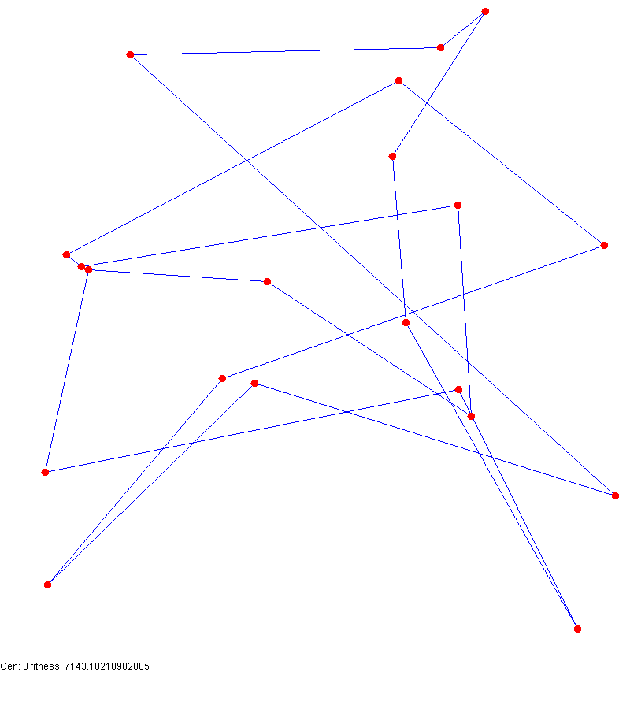
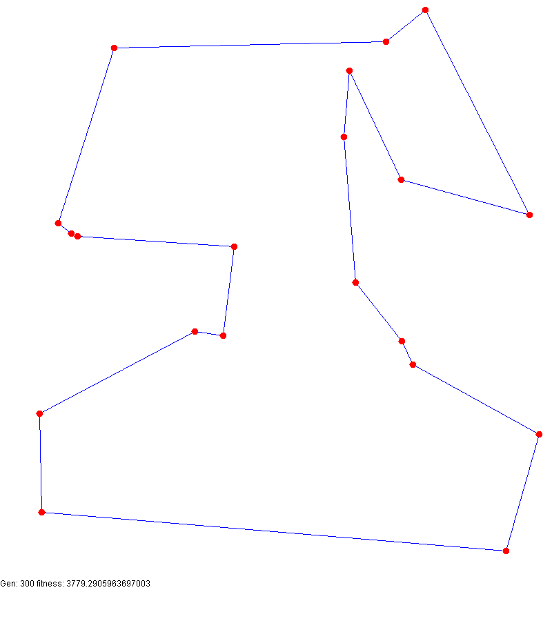

# Salesman problem solved with Genetic Algorithm
This simple project will solve the **Salesman problem** using genetic algorithm and **generate the GIF automatically.**

The algorithm is pretty simple:
1. Generate a population of random routes
2. Repeat N times (with N the number of generations you want to simulate):
   1. sort individuals by fitness (total distance of the route)
   2. save the best 33% and kill the others
   3. mutate the best 33% and keep the mutants
   4. merge the best 33% two by two (reproduction) and keep the children
   5. the new population is the combination of the previous 3 groups





## Run
``` bash
#without parameters
sbt run

#with parameters: number_of_cities max_coordinates number_of_generations
sbt "run 5 100 1"
```